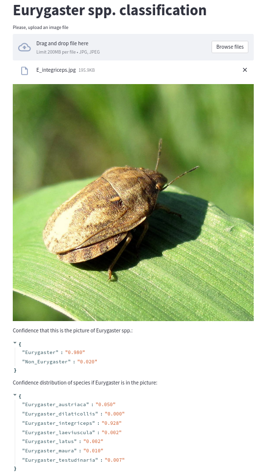

#### Eurygaster spp. classification application

* The project is based on [streamlit](https://share.streamlit.io/daniellewisdl/streamlit-cheat-sheet/app.py) deployment
  python library.
* Application is available for [Heroku](https://www.heroku.com/) and Docker deployment.
* Link to the Heroku demo: [eurygaster-app](https://eurygaster-app.herokuapp.com/).



#### Set up the application with Docker:

```bash
# Create container from Dockerfile
$ docker build -f ./dockerfiles/linux.Dockerfile -t eurygaster_app:latest .
# Create subnet for the application, set static ip and run the app
$ docker network create --subnet=172.55.0.0/29 eurygaster_subnet
$ docker run --net eurygaster_subnet \
             --ip 172.55.0.2 -p 8501:8501 --rm -t -d \
             -v /home/${USER}/eurygaster_uploads:/app/uploads \
             --name eurygaster_app eurygaster_app:latest
```

#### Set up the application with Docker-compose
```bash
# Create container with Docker-compose. It automatically creates volume and mount image uploads to it.
# Assume, that we have /home/${USER}/eurygaster_uploads directory
$ mkdir /home/${USER}/eurygaster_uploads
$ docker-compose up
# Now, all the images uploaded to application for inference can be seen in FOLDER
# To change mounting volume, create your custom directory and set it in MOUNTING_VOLUME parameter in .env.
# .env also stores: SUBNET, MASK, GATEWAY, application IP
```

#### Set up the application with Docker. Windows:

Basically, Docker containers works on Windows via Hyper-V or WSL2.
However, there are some [limitations](https://docs.docker.com/desktop/windows/networking/) like the absence of docker0
network interface and  per-container ip addressing. To deal with such limitations windows containers can be exploited.
Nonetheless, Windows containers are not a cure and in fact are large. 
The repository provides an example with Windows Core Server 2019 version 1809.
```bash
# Create container from Dockerfile
> docker build -f .\dockerfiles\wincoreserver1809.Dockerfile -t eurygaster_app:latest_windowsservercore_1809 .
# You can use default Docker network interface NAT. For example, for subnet  172.19.16.0 
> docker run --net nat `
             --isolation process `
             --ip 172.19.16.2 -p 8501:8501 --rm -t -d `
             -v C:\Users\eurygaster_uploads:C:\app\uploads `
             --name eurygaster_app eurygaster_app:latest_windowsservercore_1809
```

#### Search images in Dockerhub:

```bash
$ docker search eurygaster_app
```

#### Pull recent image from Dockerhub:

```bash
# linux/amd64
$ docker pull alrdockerhub/eurygaster_app:latest
# windows/amd64 Windows Core Server 2019 version 1809
$ docker pull alrdockerhub/eurygaster_app:latest_windowsservercore_1809
```
