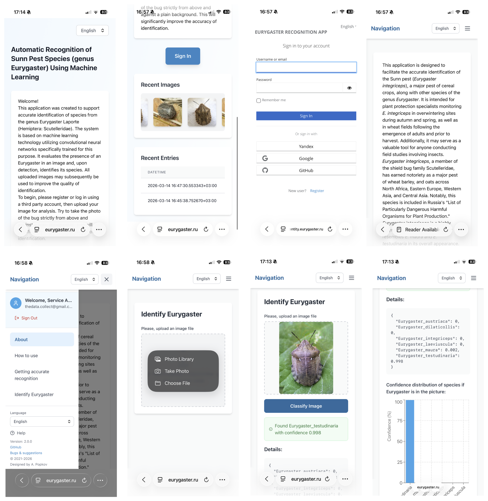

### Eurygaster spp. classification service

Welcome to the official repository of **[Eurygaster spp. recognition](https://eurygaster.ru)** app.

Service and frontend source code lives under **`src/`**. Layout of the main modules:

```text
src/
├── entries/           # Recent-entries HTTP API 
├── identity/          # Authorization
├── inference/         # Model infernece service
├── nginx/             # TLS / reverse-proxy configs for the public edge
├── queue_handler/     # RabbitMQ consumer → object storage / Telegram
├── storage/           # MinIO stack
└── webpage_v2/        # React + TypeScript web app
    ├── public/        # Static assets, markdown content
    └── src/           # Application source (pages, components, services)
```

* Architecture: [docs/ARCHITECTURE.md](./docs/ARCHITECTURE.md)
* Models preparation: [src/inference/README.md](./src/inference/README.md)

#### System deployment


```bash
## CPU-supported minimal version without in-place storage
$ make up_cpu_system_nano
## CPU-supported minimal version
$ make up_cpu_system_minimal
## CPU-supported version with error tracking
$ make up_cpu_system

### Apply resource limits to any setup
$ make ENV_FILE=.env-limits-dev up_<SETUP_NAME>
```

Application:



