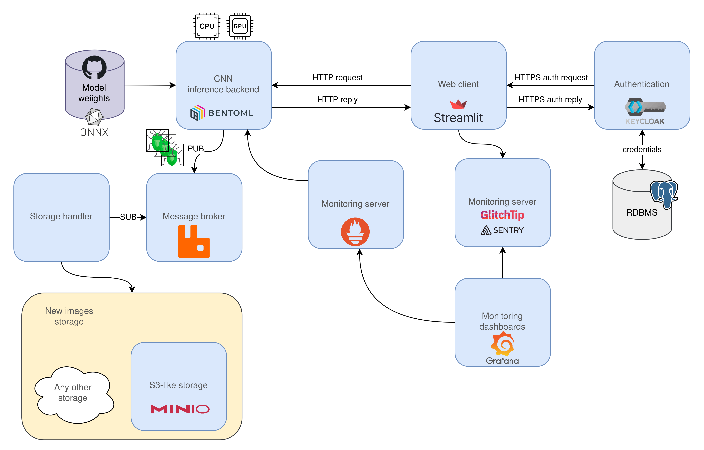
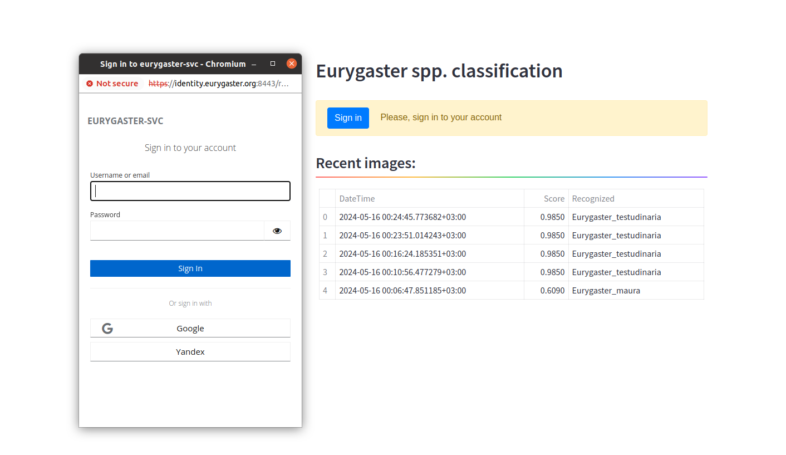

### Eurygaster spp. classification service

ML system schema:




Usage:




#### How to prepare models cascade with BentoML
```bash
# Load models into BentoML
$ python prepare_models.py \
  --tag v1.3.0 \
  --model_name \
    model_0d03affcc3fe4555217e01aee7d73fed7ebdf35a_binary_calib_dyn.onnx \
    model_4fa9730aef422d53cf1ccb3db93da78d68991301_multiclass_calib_dyn.onnx

# Prepare inference service
$ bentoml build  # Standard BentoML service
$ bentoml build -f bentofile-gpu.yaml # BentoML service with GPU support
$ bentoml containerize eurygaster:<BENTO_TAG>

# Test models with BentoML
$ make bento_test
```

#### How to deploy the system with Docker compose
```bash
# GlitchTip errors monitor
$ cd glitchtip && docker compose up
# Images storage
$ cd storage && docker compose --env-file=.env-dev up
# Identity provider
$ cd identity
$ openssl req -newkey rsa:2048 -nodes -keyout server.key.pem -x509 -days 3650 -out server.crt.pem
$ docker compose --env-file=.env-dev up
# Eurygaster service, WebPage, Prometheus, Grafana, RabbitMQ, QueueHandler
## CPU-only version
$ docker compose --env-file=.env-dev up
## GPU-supported version
$ docker compose --env-file=.env-dev -f docker-compose-gpu.yaml up
```

#### How to run load tests
```bash
$ make load_test
```

#### How to connect GlitchTip to Grafana
* Add [plugin](https://grafana.com/grafana/plugins/grafana-sentry-datasource/?tab=installation) to `./grafana/plugins/grafana-sentry-datasource`
* Add auth token according to [integration description](https://glitchtip.com/documentation/integrations)
