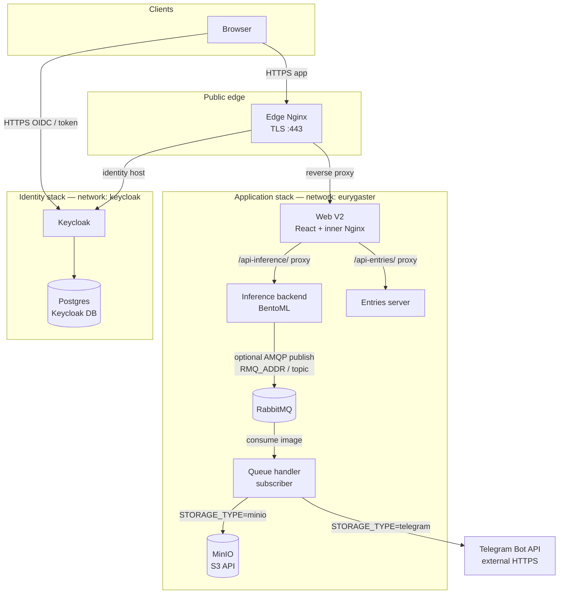

# Architecture overview

This document describes how the main runtime components of the Eurygaster recognition stack.
---

## Main entities

| Entity                        | Role                                                                                                   |
| ----------------------------- | ------------------------------------------------------------------------------------------------------ |
| **Edge Nginx**                | TLS termination and routing: public app hostname vs. identity subdomain.                               |
| **Web V2 (React)**            | Static SPA plus an inner Nginx that proxies API paths to backend services.                             |
| **Inference backend**         | BentoML service (`eurygaster-svc`): classification and optional publish to the broker after inference. |
| **Entries server**            | Small HTTP service backing recent-entry / preview features with SQLite support                         |
| **Keycloak**                  | OIDC / identity provider                                                                               |
| **Postgres**                  | OIDC / identity provider database                                                                      |
| **RabbitMQ**                  | AMQP broker; topic exchange for images (`NewImages`, routing key `image`).                             |
| **Queue handler**             | Subscriber: consumes image messages and persists or notifies via configured **storage backend**.       |
| **Storage backend: MinIO**    | S3-compatible object storage                                                                           |
| **Storage backend: Telegram** | External Bot API for photo + metadata delivery                                                         |

Docker networks in use: 
* The main stack attaches to **`eurygaster`**
* The identity stack defines **`keycloak`**, which the edge Nginx joins so it can reverse-proxy to Keycloak.

---

## High-level communication

---

## Configuration notes

- **Message broker**: The inference service publishes only when `RMQ_ADDR` is set; exchange name defaults via `RMQ_TOPIC` (see `src/inference/publisher.py`). The queue handler declares the same topic exchange and binds a queue with routing key `image` (`src/queue_handler`).
- **Storage / notification**: `queue_handler` selects implementation with `STORAGE_TYPE` (`minio`, `telegram`, or `empty`). MinIO credentials use `MINIO_*` environment variables; Telegram uses `TG_BOT_TOKEN` and `TG_GROUP_ID` (`src/queue_handler/queue_handler/storage.py`).
- **Keycloak URL**: The application is built with `VITE_AUTH_*` pointing at the public Keycloak base URL. Keycloak persists state in Postgres (`src/identity/docker-compose.yaml`).
